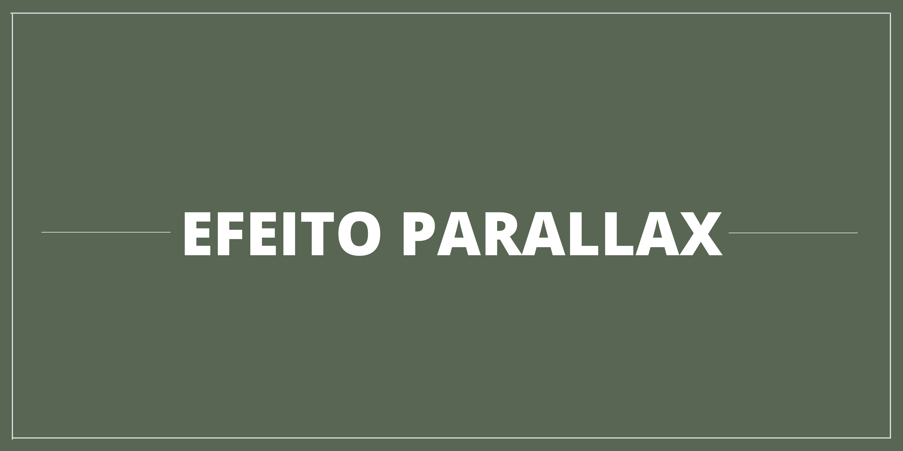

<h1 align="center">
    
</h1>

<h1>
    
</h1>


<h2 align="center">
    <a href="https://elias-neto.github.io/Site-com-Parallax/"> Veja o Site</a>
</h2>  
<div>

---

## 📗 Sobre

A ideia do projeto era fazer um site com o famoso efeito Parallax. Utilizei essas imagens para dar um efeito de caminho: Passeio de Balões, Pegando a Estrada, Pôr do Sol e Montanhas.


---

## 🛠 Tecnologias usadas

O projeto foi desenvolvido utilizando as seguintes tecnologias:

- [HTML](https://www.w3schools.com/html/)
- [CSS](https://www.w3schools.com/css/default.asp)

---

## 🗂 Como baixar o projeto


 **<h3>❕ Pré-requesitos</h3>**
Antes de começar, você vai precisar ter instalado em sua máquina as seguintes ferramentas:
[Git](https://git-scm.com)

Além disto é bom ter um editor para trabalhar com o código como [VSCode](https://code.visualstudio.com/)


````bash
    
    # Clone este repositório
    $ git clone https://github.com/Elias-Neto/Galeria-de-Fotos.git

    # Entre no diretório
    $ cd Galeria-de-Fotos

    # Instale as dependências
    $ yarn install

    # Inicie o projeto
    $ yarn start 

`````
---
<br>

<p align="center"> Desenvolvido com 🤎 por Elias de Araújo Ferreira Neto 👋 <p>
